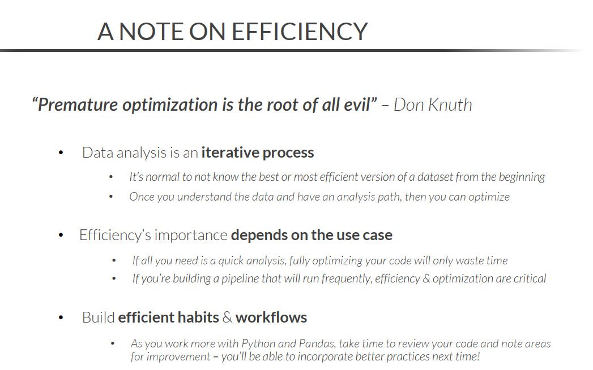

# Numpy 

```py
arr_two = np.array([[0,1,2,3],[4,5,6,7]])

arr_two.sum(axis=0) # column axis
arr_two.sum(axis=1) # row axis

```

## Aggregate and Statistical Functions In Numpy

function | Use
-|-
**np.sum(m)**     |Used to find out the sum of the given array.
**np.prod(m)**    |Used to find out the product(multiplication) of the values of m.
**np.mean(m)**    |It returns the mean of the input array m.
**np.std(m)**     |It returns the standard deviation of the given input array m.
**np.var(m)**     |Used to find out the variance of the data given in the form of array m.
**np.min(m)**     |It returns the minimum value among the elements of the given array m.
**np.max(m)**     |It returns the maximum value among the elements of the given array m.
**np.argmin(m)**  |It returns the index of the minimum value among the elements of the array m.
**np.argmax(m)**  |It returns the index of the maximum value among the elements of the array m.
**np.median(m)**  |It returns the median of the elements of the array m.

```py
np.percentile(array, n)     # returns a value in the nth percentile in an array
np.unique(array)            # returns the unique values in an array
np.sqrt(array)              # returns the square root of each value in an array
np.sort(array, axis=0)      # sort values by columns
```

- - -

# Series

Key properties:
- values
- index
- name
- dtype 

Series has inclusive if slicing index is above custom indices

## iloc

Access values by index positional

## loc

Access values by custom labels

## Logical operators & methods

description | python operator | pandas method
-|:-:|:-:
equal | == | .eq()
not equal | != | .ne()
less than or equal | <= | .le()
less than | < | .lt()
greater than or equal | >= | .ge()
greater than | > | .gt()
membership test | in | .isin()
inverse membership test | not in | ~.isin()

## Arithmetic operators & methods

operation | python operator | pandas method
-|:-:|:-:
addition | + | .add()
subtraction | - | .sub() <br> .subtract()
multiplication | * | .mul() <br> .multiply()
division | / | .div() <br> .truediv() <br> .divide()
floor division | // | .floordiv()
modulo | % | .mod()
exponentiation | ** | .pow()

## String methods

method|-
-|-
`.strip()`, `.lstrip()`, `.rstrip()` 
`.upper()`, `.lower()`
`.slice(start:stop:step)`
`.count("string")`
`.contains("string")`
`.replace("a","b")`
`.split("delimiter",expand=True)` 
`.len()`
`.startswith("string")`, `.endswith("string")`

## Numeric series aggregation

method|-
-|-
`.count()`
`.first()`, `.last()`
`.mean()`, `.median()`
`.min()`, `.max()`
`.argmax()`, `.argmin()` | index fot the smallest or largest
`.std()`, `.var()`
`.mad()` | mean absolute deviation
`.prod()` | product of all items
`.sum()`
`.quantile()` | (list) specific percentile

If use `.quantile([.5], interpolation='nearest')` return real value in series

### Aggregate categorical series

method |-
-|-
`.unique()` | array of distinct items
`.nunique()` | number of distincts
`.value_counts()` | items and frequency

If use `.value_counts(normalize=True)` return percent of each element over the total

## Identifying missing data

 - Use `.isna()` for this purpose 
 - `df.isna().sum()` return the count of NaN values 
 - `df.value_counts(dropna=False)` count the all values, include NaN 

## Handling missing data

- `.dropna()` - remove rows
- `fillna()` - replace with other value


`reset_index(drop=True)` -> drop old index

## Apply method

`df.apply(lambda x: x[-1] if len(x) > 3 else 0)``

## Where method

`df.where(logical test, value if False, inplace=False)`

\# of `numpy.where`

trick: invert condition with `~`

you can **chain.where() methods** to combine logical expressions

```py
(clean_wholesale
.where(~(clean_wholesale > 20), round(clean_wholesale * 0.9, 2))
.where(clean_wholesale > 10, 0)
)
```

# Dataframes

## Dataframes properties

- **shape** - number of rows and columns
- **index** - by default a range of integers (axis = 0)
- **columns** - columns index in a DataFrame (axis = 1)
- **axes** - the row and column indice in a DF
- **dtypes** - for each Series in DF

## Exploring a dataframe

- **head** - first n rows
- **tail** - last n rows
- **sample** - n random rows `df.sample(5, random_state=12345)`
- **info** - details: size, columns and memory usage `df.info(show_counts=True)`, for always display null count (limit aprox ~1.7m rows by default)
- **describe** - statistics for the columns - only numerical columns by default `df.describe(include='all).round()` for show all columns, round make output more readable

## Drop rows and columns

- `df.drop('column1', axis=1)`
- `df.drop(2, axis=0)`

## Identifying duplicate rows

- `df.duplicated()`
- `df.duplicated(subset='product')` - column(s) to look for duplicates

## Dropping duplicate rows

- `df.drop_duplicates()`
- `df.drop_duplicates(subset='product', keep='last', ignore_index=True)` - ign_idx reset index if necessary

## Identify missing data

- `df.isna().sum`
- `df.info()`

## Handling missing data

- `df.fillna(0)`
- `df.fillna({'price': 0, 'product': 'none'})`
- `df.dropna()`
- `df.dropna(subset='price')`

## Query method

SQL-like syntax to filter DataFrames

- `retail_df.query("family in ['CLEANING', 'DAIRY'] and sales > 0")`
- You can especify any numbers of filtering conditions by using the "and" & "or" keywords
- You can reference variables by using the "@" symbol

```py
avg_sales = retail_df.loc[:,"sales"].mean()
retail_df.query("family in ['CLEANING', 'DAIRY'] and sales > @avg_sales")
```

## Sorting dataframes by indices

`.sort_index()`

- This sort by rows (axis=0) default, but you can specify axis=1 to sort the columns
- `df.sort_index(ascending=True)`
- `df.sort_index(axis=1, inplace=True)`

## Sorting dataframes by values

`.sort_values()` 

`sample_df.sort_values(['family', 'sales'], ascending=[True,False])`

## Renaming columns

```py
product_df.columns = ['product_name', 'cost']

product_df.columns = [col.upper() for col in product_df.columns]

product_df.rename(columns={'product': 'product_name', 'price': 'cost'})

product_df.rename(columns=lambda x: x.upper())
```

## Reordering columns

- Pass a list of the existing columns in their desired order, and specify axis=1

```py
product_df.reindex(labels=['product_id', 'product', 'price'], axis=1)
```

## Numpy select

- Create columns based on multiple conditions

```py
conditions = [
    (baby_book["date"] == "2017-02-23") & (baby_book["family"] == "BABY CARE"),
    (baby_book["date"] == "2017-12-24") & (baby_book["family"] == "BOOKS"),
    (baby_book["date"] == "2017-09-06") & (baby_book["store_nbr"] > 28),
]

choices = ["Winter Clearance", "Christmas Eve", "New Store Special"]

baby_books["Sale_Name"] = np.select(conditions, choices, default="No Sale")
```

## Mapping values to columnns

- Create new columns by mapping dictionary keys

```py
mapping_dict = {'Dairy':'Non-Vegan', 'Vegetables':'Vegan', 'Fruits':'Vegan'}

produt_df['Vegan?'] = product_df['product'].map(mapping_dict)
```

- You can apply lambda functios (and others)

```py
product_df['price'] = product_df['price'].map(lambda x: f'R${x}')
```

## Assign method

- Create multiples columns at once

```py
sample_df.assign(tax_amount=sample_df['sales'] * 0.05)
```  

# Pandas data types

> **NUMERIC**

Data Type | Description | Bit Sizes | Lib
-|-|-|-
bool| Boolean True/False|8|NumPy
int64 *(default)*|Whole Numbers | 8, 16, 32, 64|NumPy
float64 *(default)*|Decimal Numbers | 8, 16, 32, 64|NumPy
boolean|Nullable Boolean True/False |8|Pandas
Int64 *(default)*|Nullabe Whole Numbers | 8, 16, 32, 64|Pandas
Float64 *(default)*|Nullabe Decimal Numbers | 8, 16, 32, 64|Pandas

> **Object / Text**

Data Type | Description
-|-
object | Any Python object
string | Only contains strings or text
category | Maps categorical data to a numeric array for efficiency

> **Time Series**

Data Type | Description
-|-
datetime | A single moment int time
timedelta | The duration between two dates or times
period | A span of time

## Convert data types

`sample_df['sales_int'] = sample_df['sales'].astype('int')`

`sample_df = sample_df.astype({'date':'datetime64', 'onpromotion':'float'})`

## Memory Optimization

- Deep = True provide more accurate results

`class_data.memory_usage(deep=True).sum()`
`class_data.info(memory_usage='deep')`

Rules:

1. Drop unecessary columns
1. Convert object types to numeric or datetime
1. Downcast numeric data to the smallest appropriate bit size
1. Use the categorical datatype for columns where the number of unique values < rows / 2

_**Numeric:**_
. | . 
:-:|-:
 8-bits | +- 127 
 16-bits | +- 32.767
 32-bits | +- 2.147.483.647
64-bits | +- 9.223.372.036.854.775.807





# Grouping dataframes

 `small_reatail.groupby('family')[['sales']].sum()`
>- Double brackets returns a DataFrame, one return a Series

## Grouping multiple columns 

```py
sales_sums = (small_retail
                .groupby(['family', 'store_nbr'], as_index=False)
                [['sales']]
                .sum()
)
```

- If you use **as_index=False** prevent the grouped columns from becoming indices

## Multi-index dataframes

- They are stored as a list of tuples

### Modifying multi-index dataframes

**RESET THE INDEX**

`.reset_index()`
- Moves the index levels back to DataFrame columns

**SWAP THE INDEX LEVEL**

`.swaplevel()`
- Changes the hierarchy for the index levels

**DROP AN INDEX LEVEL**

`.droplevel('family')`
- Drops an index level from the DataFrame entirely

## The agg method

`.agg()` allow perform multiple aggregations on a "groupby" object

```py
(small_retail
.groupby(['family', 'store_nbr'])
.agg(
    sales_sum=('sales','sum'),
    sales_avg=('sales','avg'),
    on_promotion_max=('onpromotion','max'))
)
```

## Transform

`.transform()`
- Can be used to perform aggregations without reshaping

```py
small_retail.assign(store_sales = (small_retail
                                    .groupby('store_nbr')['sales']
                                    .transform('sum')))
```

## Pivot Tables

- Let`s you create Excel-style Pivot Tables

```py
smaller_retail.pivot_table(index='family',
                            columns='store_nbr',
                            values='sales',
                            aggfunc='sum',
                            margins=True)
```

- Pivot table method has these arguments:
    - **index** roww
    - **columns** cols
    - **values**
    - **aggfunc**
    - **margins** totals by rows and cols

- Multiple aggregations functions

```py
smaller_retail.pivot_table(index='family',
                            columns='store_nbr',
                            values='sales',
                            aggfunc=({'sales':['sum', 'mean'], 'onpromotion':'max'}))
```

- Heatmaps in Pivot Table

`.style.background_gradient(cmap="RdYlGn", axis=None)`
- Axis = None -> Apply to all dataframe
- Axis = 0 -> To rows
- Axis = 1 -> To Columns

## Melt

- The `.melt()` method will *unpivot* DataFrame , or convert columns into rows

`country_revenue.melt(id_vars='country')`

```py
country_revenue.melt(
    id_vars='country',
    value_vars=['2001', '2002', '2003'],
    var_name='year',
    value_name='GDP'
)
```

# Time Series

## Date Time conversions

- Ignore errors will return the Series as an 'object', not datetime

```py
shipping_dates.astype(
    {'order_date':'datetime64', 'delivery_date':'datetime64'}, errors='ignore'
)
```

### TO_DATETIME

- Option more flexible

```py
shipping_dates['delivery_date'] = pd.to_datetime(
    shipping_dates['delivery_date'],
    errors='coerce',
    infer_datetime_format=True,
    # format= '%Y-%M-%D',
)
```

- **NaT** -> for _'not a time'_

## Datetime codes

> **DATE**

Code | Example | Description
-|-|-
%D | 07/14/2022 | Zero-padded date (basead on OS Settings)
%Y | 2023 | Four-digit year
%m | 07 | Month of the year
%B | July | Full month name
%d | 14 | Day of the month
%w | 4 | Weekday number (0-6, Sunday-Saturday)
%A | Thursday | Full weekday name
%U | 28 | Week of the year (starting on the first Sunday)
%j | 195 | Day of the year

> **TIME**

Code | Example | Description
-|-|-
%T | 16:36:30 | Zero-padded time (24-hour format)
%H | 16 | Hour (24-hour format)
%I | 04 | Hour (12-hour format)
%p | PM | AM or PM (based on OS Settings)
%M | 36 | Minute
%S | 30 | Second

- Extract parts of datetime by 2 methods

`sales.date.dt.year`

`sales.date.dt.strftime('%Y')`

_**Parts**_
- dt.date
- dt.year
- dt.month
- dt.day
- dt.dayofweek
- dt.quarter
- dt.hour
- dt.minute
- dt.second

## Time delta

`.to_timedelta()` - use frenquencies to return timedelta values

Frequency | Unit
-|-
D|Day
W|Week
H|Hour
T|Minute
S|Second

```py
pd.to_timedelta(5, unit='D')

shipping_dates + pd.to_timedelta(5, unit='W')
```

> Months, quartes and year only use in _**resampling**_

-|-
-|-
M|Month
Q|Quarter
Y|Year

## Time series indices

```py
sales.loc[sales['date'].dt.year == 2023]

sales.set_index('date').loc['2023']

dates.loc['2022']

dates.loc['2022':'2023']

dates.loc['2022-01':'2022-02']

dates.loc['2022-01-01':'2022-02-28']
``` 

## Missing time series data

```py
dates.ffill() # foward
dates.bfill() # back

dates = dates.astype('float64')
dates.interpolate() # average two elements
```

## Shifting series

`dates.shift(-1)`

- Specify any positive or negative number to shift

```py
(dates / dates.shift(1)).sub(1).mul(100).round(2)
# Calculating period-over-period growth
```

$$\text{Growth} = \dfrac{\text{Current Period}}
{\text{Previous Period}}-1$$

## Diff

`dates.diff()`

- Calculates the difference between the values in a Series and those same values shifted a specified number of periods

`dates.diff(2)`

- Previous by default, but you can specify the numbers of rows as well

## Aggregating time series

 **Resampling** is a special form of time series aggregation that modifies date indices and fills any gaps to create continuous date values

 `dates.resample('M').sum()`